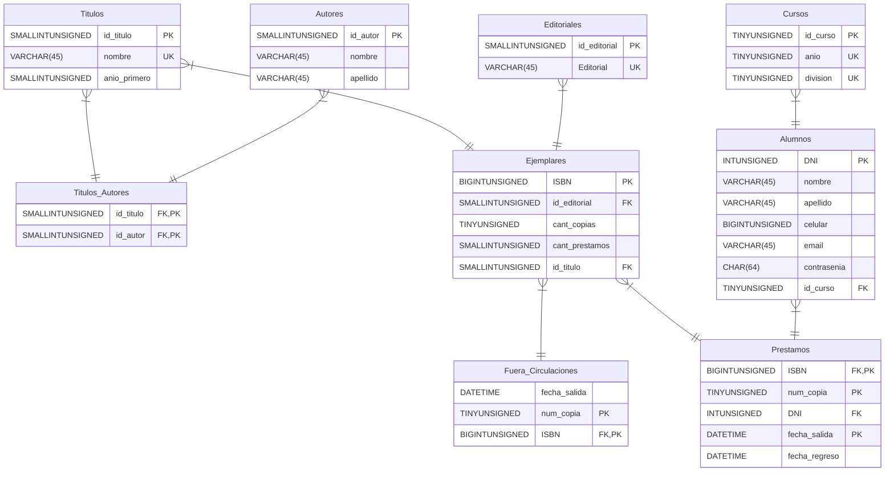
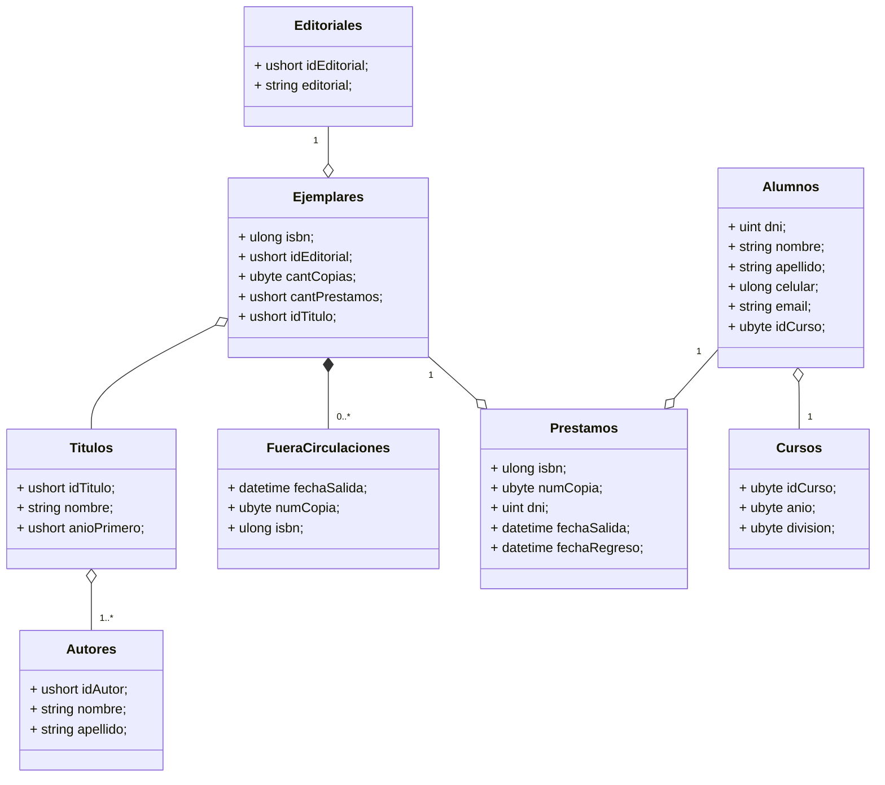

### DER 

### Como correr DB

1. Venir a este directorio (`/scripts`) y ejecutar el comando `mysql -u user -p` donde `user` es el usuario.
1. Ingresar la pass
1. Ejecutar desde la shell de MySQL el comando `SOURCE install.sql`

### Diagrama de clases
