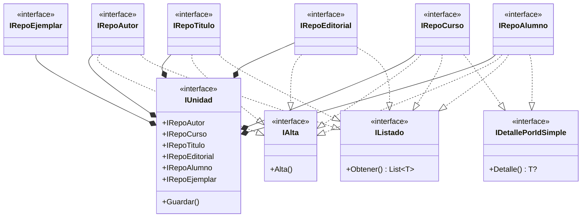

### Biblioteca.Core.Persistencia

```mermaid

classDiagram 
IRepoAutor --* IUnidad
IRepoAutor ..|> IAlta
IRepoAutor ..|> IListado
IRepoCurso --* IUnidad
IRepoCurso ..|> IAlta
IRepoCurso ..|> IListado
IRepoCurso ..|> IDetallePorIdSimple
IRepoTitulo --* IUnidad
IRepoTitulo ..|> IAlta
IRepoTitulo ..|> IListado
IRepoEditorial --* IUnidad
IRepoEditorial ..|> IAlta
IRepoEditorial ..|> IListado
IRepoAlumno --* IUnidad
IRepoAlumno ..|> IAlta
IRepoAlumno ..|> IListado
IRepoAlumno ..|> IDetallePorIdSimple
IRepoEjemplar --* IUnidad


     class IRepoAutor{
        <<interface>>
    }
    class IRepoCurso{
         <<interface>>
    }
    class IRepoTitulo{
        <<interface>>
    }
    class IRepoEditorial{
        <<interface>>
    }

    class IRepoAlumno{
        <<interface>>
    }
    class IRepoEjemplar{
        <<interface>>
    }
    class IListado{
        <<interface>>
        +Obtener() List~T~
    }
    class IDetallePorIdSimple~T~{
        <<interface>>
        +Detalle() T?
    }
    class IAlta{
        <<interface>>
        +Alta()
    }
    class IUnidad {
        <<interface>>
        +IRepoAutor
        +IRepoCurso
        +IRepoTitulo
        +IRepoEditorial
        +IRepoAlumno
        +IRepoEjemplar
        +Guardar()        
    }

```