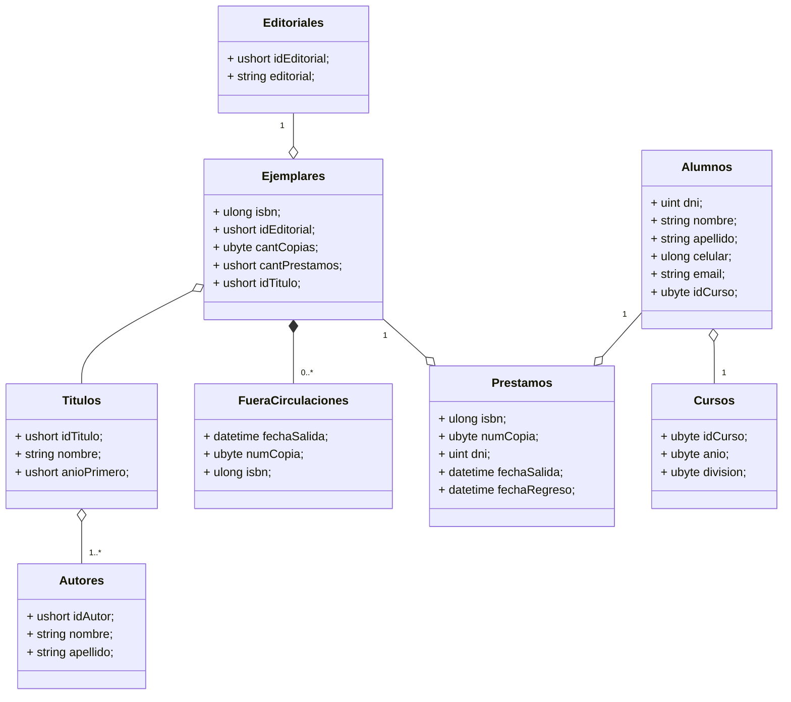

```mermaid
classDiagram
    Titulos  o-- "1..*"Autores
    Ejemplares o-- Titulos
    Ejemplares *-- "0..*" FueraCirculaciones
    Alumnos "1" --o Prestamos
    Ejemplares "1" --o Prestamos
    Editoriales "1" --o Ejemplares
    Alumnos o-- "1" Cursos
    class Titulos{
        + ushort idTitulo;
        + string nombre;
        + ushort anioPrimero;
    }
    class Autores{
        + ushort idAutor;
        + string nombre;
        + string apellido;
    }
    class Ejemplares{
        + ulong isbn;
        + ushort idEditorial;
        + ubyte cantCopias;
        + ushort cantPrestamos;
        + ushort idTitulo;
    }
    class Editoriales{
        + ushort idEditorial;
        + string editorial;
    }
    class Cursos{
        + ubyte idCurso;
        + ubyte anio; 
        + ubyte division;
    }
    class Alumnos{
        + uint dni;
        + string nombre;
        + string apellido;
        + ulong celular;
        + string email;
        + ubyte idCurso;
    }
    class Prestamos{
        + ulong isbn;
        + ubyte numCopia;
        + uint dni;
        + datetime fechaSalida;
        + datetime fechaRegreso;
    }
    class FueraCirculaciones{
        + datetime fechaSalida;
        + ubyte numCopia;
        + ulong isbn;
    }
```